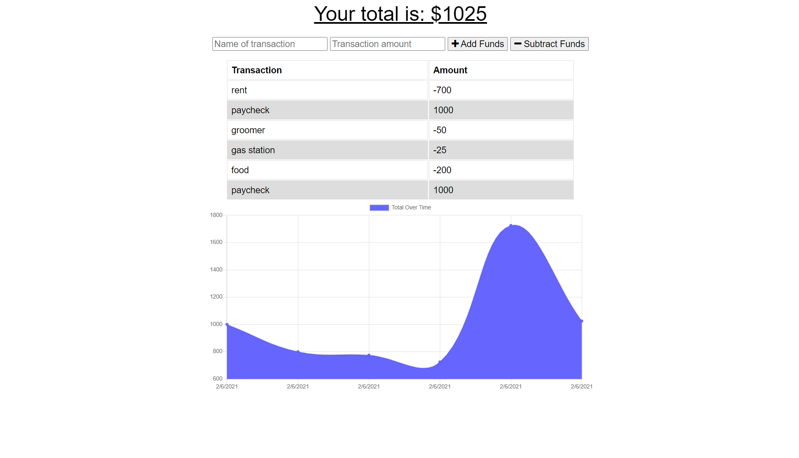

# online-offline_budget_trackers

This application uses PWA to allow users to access their budget while offline and use it as if they are still online. The applications remains fully functional from the user interface without network connection due to the web manifest and service worker files. These allow the application to replicate the pages from the fully functioning app and then deliver a template that mirrors it while the application goes offline. 

